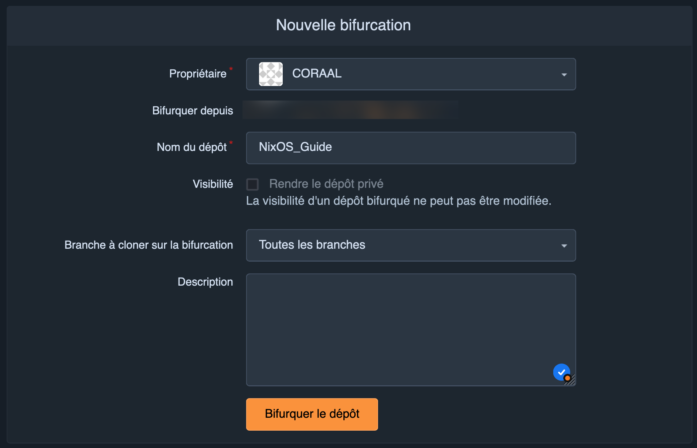
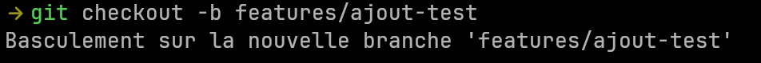

# 🛠️ Contribuer au guide 
<!-- 
    TODO: 
    - Ajouter des illustrations pour montrer comment contribuer
      - Bouton fork
      - Créer une branche
      - Modifications
      - Soumettre une pull request
    - Donner plusieurs exemples de noms pour les branches 
      - Ajout de documentation
      - Modifier un exemple
      - Reformuler
      - Corriger des fautes
-->

Merci de l'intérêt que vous portez à ce guide ! 

Toutes les constributions sont appréciés, qu'il s'agisse d'améliorer la documentation,
d'ajouter des informations ou de corriger des erreurs.

Voici quelques directives pour vous aider à démarrer. 

## 🧭 Où commencer ? 

1. 📖 **Lisez le guide** : Prenez le temps de vous familiariser avec le contenu actuel pour éviter les doublons et comprendre le style adopté.
2. 🐛 **Signalez un problème** : Si vous repérez des erreurs, des fautes de frappe, des sections qui manquent de clarté, ouvrez une issue.
3. 💡 **Suggérez une amélioration** : Si vous avez une idée d'amélioration ou si vous souhaitez ajouter une nouvelle section, vous pouvez ouvrir une issue pour en discuter.
Vous pouvez également soumettre une pull request. 

## 📑 Types de contribution 

### ✏️ 1. Correction de fautes, amélioration de la rédaction 

* Relecture et correction des erreurs de grammaire ou d'orthographe.
* Réécriture pour plus de carté ou de fluidité.
* Ajout de commentaires ou d'explications supplémentaires sur les concepts.

### 🛠️ 2. Mise à jour des informations techniques

* Vérifiez que le contenu est à jour avec les denrières versions de NixOS et de ses outils.
* Ajoutez des détails techniques sur des fonctionnalités ou des changements récents.

### 🌟 3. Ajout d'exemples, d'illustrations ou de nouvelles idées

* Proposez de nouveaux exemples concrets.
* Ajoutez des captures d'écran ou des schémas pour illustrer les étapes importantes.
* Ajoutez des cas d'usages.

### 🏗️ 4. Amélioration de la structure du guide

* Suggérez des réorganisations pour rendre le guide plus accessible.
* Ajoutez des liens ou des références entre les sections pour plus de cohérence.

## 🚀 Processus de soumission

1. **Forkez le dépôt** : Créer une copie du dépôt sur votre compte. 

2. **Créez une branche** : Utilisez des noms de branches descriptifs (ex: features/ajout-exemples-images).

3. **Faites vos modifications** : Assurez-vous que chaque contribution est bien justifiée et bien expliquée.
4. **Testez vos modifications** : Si vous avez ajouté des images, vérifiez qu'elle apparaissent correctement dans la version markdown.
5. **Soumettez une PR** : Ouvrez une pull request en expliquant brièvement les changements proposés.

## 🖼️ Format des images

- **Taille** : Essayez de maintenir une taille raisonnable pour les images. Le contenu doit être lisible. 
- **Formats** : Utilisez de préférences des formats légers comme PNG.
- **Nommage** : Utilisez des noms descriptifs pour les fichiers d'image (`installation-step-1.png`)

## 🔍 Revue des PR

Toutes les PR seront examinées par les mainteneurs. Si des ajustements sont nécessaires, nous vous en informerons. 
Une fois approuvée, votre contribution sera intégrée au guide. 

Merci pour votre aide. 
