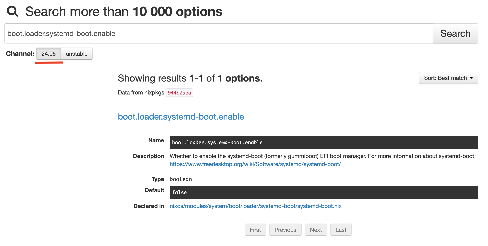
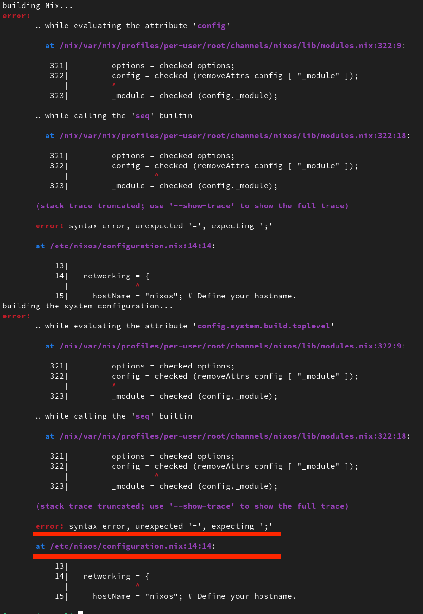
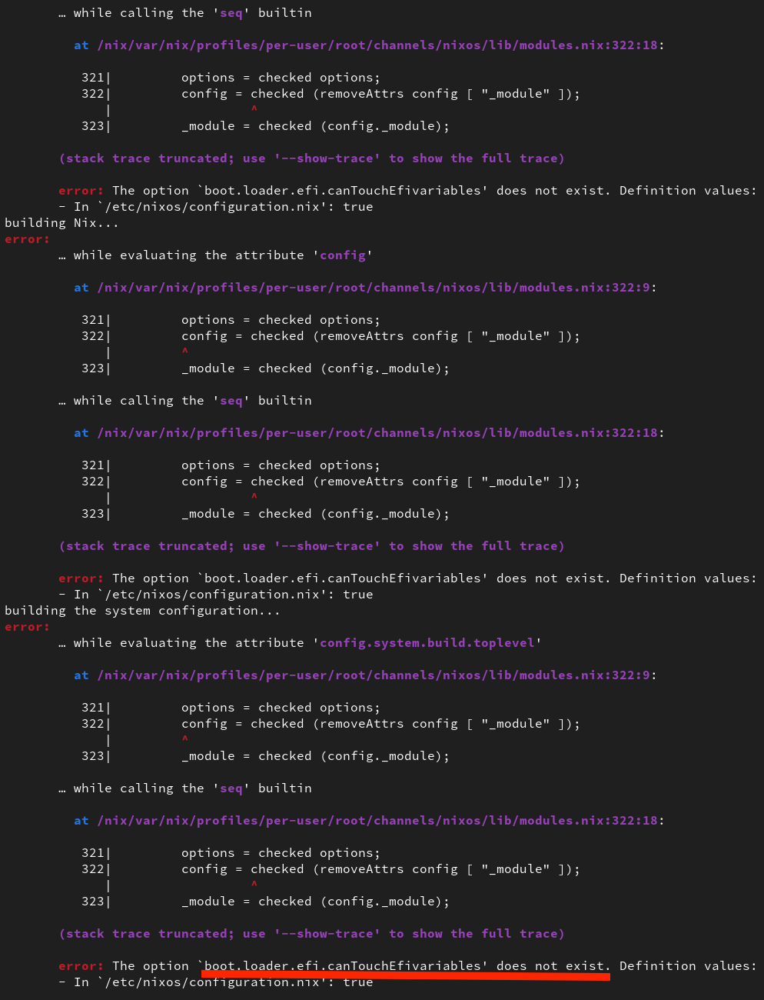

# Décortiquons la configuration

Dans cette section, nous allons explorer la configuration générée par l'installateur graphique de NixOS. 
Le but est que vous puissiez comprendre comment ajouter ou supprimer des options à votre système.

Avant de commencer, gardez à l’esprit trois points importants :

- Nix n'accorde aucune importance à l'ordre des instructions : il les interprétera de manière cohérente, peu importe l'ordre dans lequel elles sont écrites.
- De même pour l'indentation et les espaces.
- Les **instructions** se terminent toutes par un ";".  

## Les configurations

Comme vous l'avez déjà constaté, deux fichiers principaux sont générés par défaut : *configuration.nix* et *hardware-configuration.nix*.

- **configuration.nix** décrit l'état global du système : quels services sont activés, quels logiciels sont installés, et comment le système est configuré.
- **hardware-configuration.nix** contient les informations spécifiques à votre matériel, comme les partitions de disque (référencées par leurs UUID) et les modules du noyau nécessaires à votre machine.

Bien qu'il soit possible de modifier directement **hardware-configuration.nix**, il est préférable de ne pas le faire. 
Pourquoi ? 
Parce que l’un des grands avantages de NixOS est sa capacité à reconstruire un système à partir d'un simple fichier.

Si vous modifiez hardware-configuration.nix directement, ces modifications pourraient devenir obsolètes lors d'une réinstallation sur une machine différente ou non, car les UUID des partitions, les modules du noyau requis peuvent changer.

En revanche, si vous ajoutez vos modifications dans configuration.nix, vous bénéficierez d'une plus grande flexibilité. Lors d'une réinstallation, vous pourrez régénérer un nouveau fichier hardware-configuration.nix adapté au matériel de la nouvelle machine, sans perdre vos personnalisations.

En résumé : moins de maintenance et plus de simplicité. Vous régénérez un nouveau hardware-configuration.nix et repartez. 

Autre chose, ces deux fichiers auraient pu être écris en un seul emplacement, encore une fois, ça ne change rien en dehors du point évoqué précédemment. 

## On commence ?

```bash
sudo nano /etc/nixos/configuration.nix
```

Vous devriez avoir quelque chose comme ce qui suis, les commentaires en moins : 

> [!NOTE]
> Je vous recommande de lire une première fois votre fichier de configuration et surtout les commentaires. 

```nix
{ config, pkgs, ... }:

{

  imports = [
    ./hardware-configuration.nix
  ];

  boot.loader.systemd-boot.enable = true;
  boot.loader.efi.canTouchEfiVariables = true;

  networking.hostName = "nixos";

  networking.networkmanager.enable = true;

  time.timeZone = "Europe/Paris";

  i18n.defaultLocale = "fr_FR.UTF-8";

  i18n.extraLocaleSettings = {
    LC_ADDRESS        = "fr_FR.UTF-8";
    LC_IDENTIFICATION = "fr_FR.UTF-8";
    LC_MEASUREMENT    = "fr_FR.UTF-8";
    LC_MONETARY       = "fr_FR.UTF-8";
    LC_NAME           = "fr_FR.UTF-8";
    LC_NUMERIC        = "fr_FR.UTF-8";
    LC_PAPER          = "fr_FR.UTF-8";
    LC_TELEPHONE      = "fr_FR.UTF-8";
    LC_TIME           = "fr_FR.UTF-8";
  };

  services.xserver.enable = true;

  services.xserver.displayManager.gdm.enable   = true;
  services.xserver.desktopManager.gnome.enable = true;

  services.xserver.xkb = {
    layout  = "fr";
    variant = "mac"; 
  };

  console.keyMap = "fr";

  services.printing.enable = true;

  hardware.pulseaudio.enable = true;

  security.rtkit.enable = true;
  services.pipewire = {
    enable = true;
    alsa.enable = true;
    alsa.support32Bit = true;
    pulse.enable = true;
  };

  users.users.user = {
    isNormalUser = true;
    description = "user";
    extraGroups = [ "networkmanager" "wheel" ];
    packages = with pkgs; [];
  };

  programs.firefox.enable = true;

  nixpkgs.config.allowUnfree = true;

  environment.systemPackages = with pkgs; [];

  system.stateVersion = "24.05";

}
```

Nous allons nous préter à un petit exercice qui consiste à déterminer le rôle de chaque option, les grouper ensemble et les retrouver dans la documentation et
les valeurs qu'elles attendent. 

> [!WARNING]
> Je vous encourage à le faire de votre côté plutôt que de lire bêtement ma tirade, c'est une "compétence" que vous allez devoir maîtriser.
> Pour être très clair, ce que nous allons faire là, correspond à 70-80% des compétences à maîtriser.
> Tout ce qui va suivre se basera sur cette compétence.

### Les arguments de fonction

Au cas où vous ne l'auriez pas deviné, nix n'est pas qu'un gestionnaire de paquets, c'est aussi un langage de programmation. 
Lorsque l'on a besoin d'utiliser certains mots clés, je pense à `nixpkgs`, `lib`, `config` entre autre, il est nécessaire d'indiquer à nix de quoi nous parlons. 
C'est le rôle de cette première ligne : 

```nix
{ config, pkgs, ... }:
```

> [!NOTE]
> Si l'on prends le point de vue "programmation", un fichier nix comme `configuration.nix` est en réalité une grande fonction.
> Cette première ligne liste les arguments dont notre fonction a besoin. 
> Si ce n'est pas clair, dites-vous que vous aurez besoin de cette ligne lorsque les mots clés `lib`, `config`, `pkgs` apparaissent ailleurs dans le fichier.
> Nous aurons l'occasion d'en reparler.

- **config** fait référence à la configuration actuelle du système.
- **lib** fait références à des utilitaires de la bibliothèque NixOS.
- **...** signifie que la fonction pourrait recevoir d'autres arguments (mettez-le systématiquement). 

### Imports

Pour modulariser notre configuration, nous avons la possibilité de déplacer dans un autre fichier une partie de la configuration. 
Par défaut, `hardware-configuration.nix` présent dans `/etc/nixos/` est importé par `configuration.nix`

```nix
  imports = [
    ./hardware-configuration.nix
  ];
```

Deux méthodes possible, soit nous souhaitons importer un seul fichier et on utilise : 

```nix
import = ./hardware-configuration.nix
```

Mais on peut aussi vouloir importer plusieurs fichiers :

```nix
  imports = [
    ./hardware-configuration.nix
    ./foo.nix
    ./bar.nix
  ];
```

### Les options nixos

C'est ici que commence réellement la partie intéressante.
NixOS propose un très grand nombre d'options qui nous permettent de configurer un état déterminé pour un grand nombre de logiciel. 

Dans cette configuration, les options nous permettent de configurer les langues, le partitionnement, les modules à charger et ainsi de suite. 

Les options sont toutes référencés sur cette [page](https://search.nixos.org/options?).
Notez qu'à l'image des paquets, deux channels sont référencés **24.05** et **unstable**. 
Sélectionnez toujours la bonne version puisque certaines options peuvent changer, être ajouté ou encore supprimé.

Toutes les lignes que vous voyez ci-dessous sont des options, remarquez que `hardware-configuration.nix` en est pourvu également.

```nix
{

  boot.loader.systemd-boot.enable = true;
  boot.loader.efi.canTouchEfiVariables = true;

  networking.hostName = "nixos";

  networking.networkmanager.enable = true;

  time.timeZone = "Europe/Paris";

  i18n.defaultLocale = "fr_FR.UTF-8";

  i18n.extraLocaleSettings = {
    LC_ADDRESS        = "fr_FR.UTF-8";
    LC_IDENTIFICATION = "fr_FR.UTF-8";
    LC_MEASUREMENT    = "fr_FR.UTF-8";
    LC_MONETARY       = "fr_FR.UTF-8";
    LC_NAME           = "fr_FR.UTF-8";
    LC_NUMERIC        = "fr_FR.UTF-8";
    LC_PAPER          = "fr_FR.UTF-8";
    LC_TELEPHONE      = "fr_FR.UTF-8";
    LC_TIME           = "fr_FR.UTF-8";
  };

  services.xserver.enable = true;

  services.xserver.displayManager.gdm.enable   = true;
  services.xserver.desktopManager.gnome.enable = true;

  services.xserver.xkb = {
    layout  = "fr";
    variant = "mac"; 
  };

  console.keyMap = "fr";

  services.printing.enable = true;

  hardware.pulseaudio.enable = true;

  security.rtkit.enable = true;
  services.pipewire = {
    enable = true;
    alsa.enable = true;
    alsa.support32Bit = true;
    pulse.enable = true;
  };

  users.users.user = {
    isNormalUser = true;
    description = "user";
    extraGroups = [ "networkmanager" "wheel" ];
    packages = with pkgs; [];
  };

  programs.firefox.enable = true;

  nixpkgs.config.allowUnfree = true;

  environment.systemPackages = with pkgs; [];

  system.stateVersion = "24.05";

}
```

#### Type Boolean

Bien que le nom soit explicite, nous allons chercher l'option `boot.loader.systemd-boot.enable` sur cette [page](https://search.nixos.org/options?channel=24.05&from=0&size=50&sort=relevance&type=packages&query=boot.loader.systemd-boot.enable).
Si vous cliquez sur l'option, plusieurs informations vous seront montrés. 



Comme l'indique la description, cette option permet d'activer le chargeur de démarrage **systemd-boot**.

La même option existe avec [grub](https://search.nixos.org/options?channel=24.05&show=boot.loader.grub.enable&from=0&size=50&sort=relevance&type=packages&query=boot.loader.grub.enable).

Dans la section *type*, on peut lire que la valeur attendu par nix est un *boolean* à savoir **True** ou **False**.

On peut aussi lire que la valeur par défaut est **false**. 

> [!IMPORTANT]
> Ce qu'il faut comprendre ici c'est que Nix active par défaut certaines options. 
> Dans certains cas, une option peut en activer une autre si elle en dépends. 
> Prenons l'exemple de `programs.steam.enable = true;` qui active `hardware.steam-hardware.enable = true;`.

> [!IMPORTANT]
> Une autre information à avoir en tête. 
> Les options nix cachent une *abstraction*, ça signifie que derrière les options nix, nous avons une suite d'instruction écritent
> en nix qui vont activer, désactiver ou configurer des choses.
> Nous aurons l'occasion d'analyser comment ça fonctionne la dessous. 
> Pour les plus curieux, le champ **Declared in** mène à la déclaration de l'option (son "code-source" si vous préférez).

Si vous souhaitez connaître les autres options disponibles, utilisez un mot clé différents, par exemple : `boot.loader`, `programs.`, `services.`, `networking.`

#### Type String

[Documentation](https://search.nixos.org/options?channel=24.05&show=networking.hostName&from=0&size=50&sort=relevance&type=packages&query=networking.hostName)

```nix
networking.hostName = "nixos";
```

Un autre type de valeur *String* qui correspond à une **chaine de caractères**. 
Un String est **systématiquement** entouré par des guillemets ("", '').

#### Type List of String

[Documentation](https://search.nixos.org/options?channel=24.05&show=users.users.%3Cname%3E.extraGroups&from=0&size=50&sort=relevance&type=packages&query=users.users.%3Cname%3E.extraGroups)

```nix
  users.users.user.extraGroups = [ "networkmanager" "wheel" ];
```

Ici, la valeur attendu est une liste de chaine de caractères. 
Une liste est entouré de crochets, chaque éléments de la liste est entouré par des guillemets. 

> [!IMPORTANT]
> Pas de virgule pour séparer les éléments. 

#### Type Integer

[Documentation](https://search.nixos.org/options?channel=24.05&show=services.nsd.serverCount&from=0&size=50&sort=relevance&type=packages&query=services.nsd.serverCount)

Un autre type que vous pourriez être amené à recontrer sont les **Integer**, autrement dit, les nombres entiers. 
Nous n'avons aucune option dans notre configuration qui l'utilise, sachez qu'ils existent. 

```nix
services.nsd.serverCount = 1;
```

#### Conclusion

Nous pourrions passer du temps à expliquer ensemble chacune des options mais maintenant que vous connaissez la démarche, à vous de jouer. 
Cherchez à comprendre. 

<!-- 
    TODO:
    - Demandez aux "testeurs" s'il est vraiment nécessaire d'expliquer d'avantages ou non les options ?
    - On s'attends en principe à ce que les utilisateurs soient déjà un peu expérimentés avec Linux.
-->

### Formater 

Maintenant que vous avez une idée du rôle de chaque options, nous allons la "réduire" et les grouper entre-elles. 

Comme vous avez pu le constater, dans chaque option, les "sous-options" associés sont séparés des points. 
Vous pouvez vous représentez ça comme des catégories, plus on rajoute de mots et de points et plus on "filtre" la catégorie 

<!-- TODO: Pitié, moi du future, reformule ça -->

Nous pouvons continuer à écrire systématiquement l'option en entier comme pour l'exemple ci-dessous :

```nix
{

  boot.loader.systemd-boot.enable = true;
  boot.loader.efi.canTouchEfiVariables = true;

}
```

Ou alors les formater comme suit : 

```nix
{

  boot.loader = {
    systemd-boot.enable = true;
    efi.canTouchEfiVariables = true;
  };

}
```

> [!WARNING]
> **Qu'est-ce que l'on gagne à faire ça ?**
>
> -> Rien. Absolument rien.
>
> L'intérêt est de réunir en un bloc les options de même nature, c'est une façon d'améliorer la lisibilité et de 
> réduire les répétitions.
> 
> Peu importe ce que vous choissisez de faire, nix l'interprétera **de la même manière**.

En formatant ainsi notre configuration, on peut obtenir : 

```nix
{
  boot.loader = {
    systemd-boot.enable = true;
    efi.canTouchEfiVariables = true;
  };

  networking = {
    hostName = "nixos";
    networkmanager.enable = true;
  };

  time.timeZone = "Europe/Paris";

  i18n = {
    defaultLocale = "fr_FR.UTF-8";
    extraLocaleSettings = {
      LC_ADDRESS        = "fr_FR.UTF-8";
      LC_IDENTIFICATION = "fr_FR.UTF-8";
      LC_MEASUREMENT    = "fr_FR.UTF-8";
      LC_MONETARY       = "fr_FR.UTF-8";
      LC_NAME           = "fr_FR.UTF-8";
      LC_NUMERIC        = "fr_FR.UTF-8";
      LC_PAPER          = "fr_FR.UTF-8";
      LC_TELEPHONE      = "fr_FR.UTF-8";
      LC_TIME           = "fr_FR.UTF-8";
    };
  };

  services.xserver = {
    enable = true;
    displayManager.gdm.enable   = true;
    desktopManager.gnome.enable = true;
    xkb = {
      layout  = "fr";
      variant = "mac"; 
    };
  };

  console.keyMap = "fr";

  services.printing.enable = true;

  hardware.pulseaudio.enable = true;

  security.rtkit.enable = true;

  services.pipewire = {
    enable            = true;
    alsa = {
      enable       = true;
      support32Bit = true;
    };
    pulse.enable      = true;
  };

  users.users.user = {
    isNormalUser = true;
    description = "user";
    extraGroups = [ "networkmanager" "wheel" ];
    packages = with pkgs; [];
  };

  programs.firefox.enable = true;

  nixpkgs.config.allowUnfree = true;

  environment.systemPackages = with pkgs; [];

  system.stateVersion = "24.05";

}
```

Facile non ?
Vous commencez à voir les groupes d'options ? 
Un groupe gère le son, un autre l'interface graphique, les langues, etc. 

### On test ?

Sauvegardez votre fichier et sortez de l'éditeur. 
Nous allons appliquer la "nouvelle" configuration. 

```bash
sudo nixos-rebuild switch
```

Si vous avez correctement écrit la configuration, aucune erreur ne devrait apparaître.
Auquel cas... 

### Nix et ces superbes erreurs

Nix est un langage et un gestionnaire de paquets sublime. 
Un domaine dans lequel il ne brille absolument pas est la qualité de ses erreurs. 

Des erreurs tels qu'un oubli de point virgule en fin de ligne, une faute de frappe dans le nom d'une option seront compréhensible.



Ici, j'ai clairement oublié un point virgule : 

```nix
{

  boot.loader = {
    systemd-boot.enable = true;
    efi.canTouchEfiVariables = true;
  } # <--

}
```

Et là j'ai clairement mal orthographié une option. 



```nix
{

  boot.loader = {
    systemd-boot.enable = true;
    efi.canTouchEfivariables = true; # <-- variable -> Variable
  };

}
```

Ne vous laissez pas intimider par la longueur de l'erreur, il vous suffit de regarder les dernières lignes pour
comprendre la nature de l'erreur. 

Une habitude à prendre lorsque vous avez mal orthographié une option est d'aller voir sur cette [page](https://search.nixos.org/options?).
La majorité du temps, l'option a été mal orthographié. 
Il y a aussi une chance que l'option soit dépréciée depuis un moment, dans ce genre de cas, nix vous indique que l'option a été supprimé ou renommé. 

Plus tard, nous aurons l'occasion de rencontrer d'autres types d'erreurs. 

