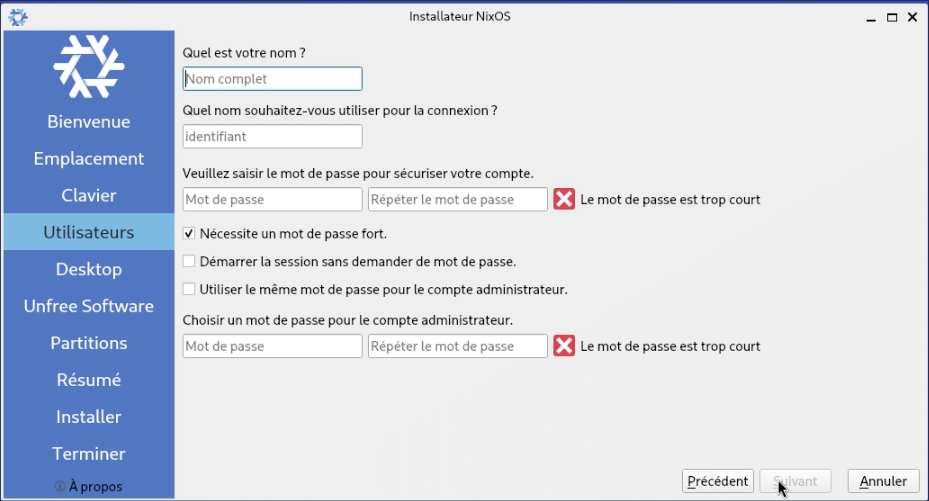

# Installation Graphique 

L'installation graphique ne présente aucune difficulté particulière, il s'agit principalement de cliquer sur suivant. 

Quelques images pour illustrer : 

> [!NOTE]
> L'installation peut sembler se bloquer à *46%*, ce n'est pas le cas. 
> Si vous cliquez sur *Toggle*, vous pourrez suivre l'avancement en détail.
> Pour référence, sur ma machine l'installation dure un peu moins de 5 minutes.

