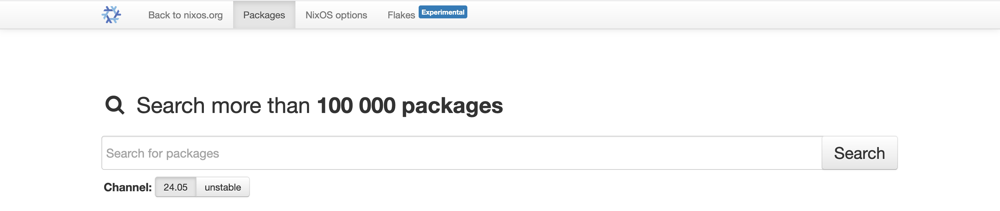
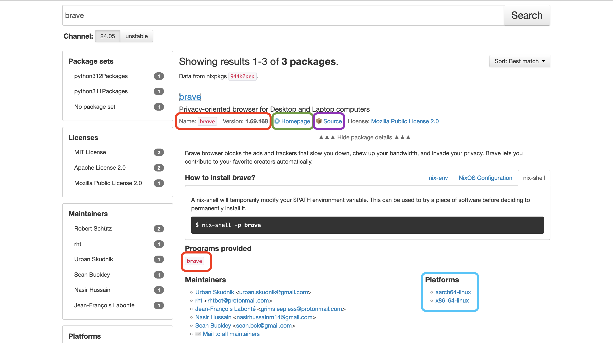

# Utilisation de base 

L'une des premières pré-occupation que les utilisateurs ont lorsqu'ils utilisent un nouveau gestionnaire de paquets est :

- *Comment installer/supprimer un paquet*
- *Comment mettre à jour le système*

> [!IMPORTANT]
> Pour ceux qui se demandent, les flocons seront abordés plus tard.
> Nous nous controns dans un premier temps sur les cas d'utilisations de base.

## Mettre à jour le système 

```bash
# Mettre à jour les "canaux" à jour
sudo nix-channel --update
# Reconstruction du système
sudo nixos-rebuild switch
```

Si vous avez déjà manipulé le gestionnaire de paquet *apt*, ces deux commandes sont plus ou moins équivalente à :

```bash
sudo apt update
sudo apt upgrade
```

## Gérer les paquets

Si les manipulations précédentes vous étaient familières, ce qui suit va marquer les premières différences avec les systèmes Linux habituels.

### Ce qu'il ne faut pas faire

> [!WARNING] 
> Nous allons voir en premier lieu ce qu'il ne faut pas faire. 
> Pour être bien clair, cette manipulation ne cassera pas votre système, elle n'a simplement pas de sens sur nixos. 
> Vous devez savoir qu'elle existe et ce qu'elle fait, mais jamais vous ne l'utiliserez. 

#### Installer un paquet de la "mauvaise façon"

Nous installons ici `htop`.

```bash
nix-env -iA nixos.htop
```

#### Supprimer un paquet de la "mauvaise façon"

```bash
nix-env -e htop
```

Intéressons-nous un instant sur les logs obtenu durant l'installation : 

```bash
installing `htop-3.3.0`
this path will be fetched (0.13 MiB download, 0.38 MiB unpacked):
    /nix/store/ifkj1fp3p2zk3q40bnz7p6rihq3blh8fp-htop-3.3.0
copying path '/nix/store/ifkj1fp3p2zk3q40bnz7p6rihq3blh8fp-htop-3.3.0' from 'https://cache.nixos.org'...
building '/nix/store/wyj48niqrxb1kq7fzj0jrqlbqv9075rs-user-environment.drv'... 
```

Nous pouvons lire `/nix/store/ifkj1fp3p2zk3q40bnz7p6rihq3blh8fp-htop-3.3.0`, il s'agit du chemin où le paquet est réellement installé. 

Sur un système classique, la commande `which htop` nous aurez donné `/usr/bin/htop`.

Sous nixos : `/home/user/.nix-profile/bin/htop`

> [!NOTE]
> **Mais... tu n'avais pas dit qu'il était dans `/nix/store` ?**
> Bien vu !

On souhaite plutôt utiliser : 

```bash
readlink -f $(which htop)
```

Et on obtiens `/nix/store/ifkj1fp3p2zk3q40bnz7p6rihq3blh8fp-htop-3.3.0/bin/htop`.

> [!NOTE]
> **Qu'est-ce qu'il faut comprendre alors ?**
> 
> Comme je l'ai précisé plus tôt, les paquets disposent de leur propre environnement isolé où sont conservés paquets et dépendances.
> Ce que nous voyons ici est un lien symbolique pointant de `/nix/store/XXXX` vers `/home/user/.nix-profile/bin/htop`. 

### La nomination des paquets dans le store

Si je reprends l'exemple précédents, nous avons obtenu le chemin ` /nix/store/ifkj1fp3p2zk3q40bnz7p6rihq3blh8fp-htop-3.3.0/bin/htop`.

Si on le décompose : `ifkj1fp3p2zk3q40bnz7p6rihq3blh8fp-htop-3.3.0` qui correspond à `hash_unique|paquet|version`. 

Le hachage garantit que chaque paquet ainsi que ces dépendances disposent d'un identifiant unique, c'est ce qui nous permet d'avoir plusieurs fois un même paquet (et ces dépendances) sur un même système. 

> [!NOTE] 
> **Qu'en est-il du stockage ? Combien d'espace le store consomme-t'il ?** 
> 
> Sur ma machine virtuelle fraichement installé utilisé au cours de l'écriture de ce guide, 
> la commande `du -hsc /nix/store` retourne **7,1G**.
> Sur MacOS (nix-darwin) : **13G** (Note dans ce cas-là, macos n'est pas inclus, uniquement les paquets nix)
> Sur mon système principal **17G**

De manière général, nixos est plus gourmand en stockage que les autres distributions.

### Paquet "provisoire"

Avant de parler de la bonne manière d'installer un paquet, nous allons voir comment utiliser un paquet de manière temporaire.
Vous avez probablement déjà vécu une situation où vous avez dû utiliser un paquet pendant moins d'une minute pour ne plus jamais reservir ensuite. 

Nix dispose d'une manière de gérer ce cas : 

```bash
nix-shell -p btop 
```

Cette commande récupère le paquet `btop` et l'ajoute au `/nix/store` et le rends accessible au shell en cours d'exécution. 
Essayez de faire `btop` dans ce shell, le programme se lancera. 

Sortez du programme via **CTRL+C** puis faite **CTRL+D** pour quitter le shell en cours. 

Relancez `btop`, oui, ça ne fonctionne plus.

Ce qu'il s'est passé est simple, en faisant `nix-shell`, nous avons demandé à nix de récupérer 
`btop` et d'ajouter un lien symbolique pour le rendre accessible au shell en cours. 

En sortant de ce shell, le lien symbolique est annulé/cassé. 

A ce stade, le paquet n'est pas supprimé du système, il est enfaite toujours dans le store. 
Si vous relancez nix-shell comme tout à l'heure, le paquet contenu dans le store sera réutilisé (un peu comme un cache). 

Nous verrons plus tard comment nettoyer le store. 

Notez que nous pouvons également exécuter nix-shell accompagné d'une commande : 

```bash
nix-shell -p btop --run btop
```

Si la commande est plus complexe : 

```bash
nix-shell -p fastfetch --run "fastfetch --help"
```

### Nettoyer le store

En dehors de la méthode automatisé que nous verrons en temps voulu, nous avons la possibilité de nettoyer manuellement les anciennes entrées inutiles. 

Parmis ces entrées "inutiles", nous retrouvons entre autre les paquets inutilisés invoqué via `nix-shell`, d'anciennes versions de paquets rendu inutile
suite à une mise à jours, etc. 


La première commande supprime tout paquets non référencés dans la configuration actuelle. 

```bash
nix-collect-garbage -d 
```

On peut aussi indiquer de supprimer uniquement ceux référencés comme inutilisé depuis plus de X jours.

```bash
nix-collect-garbage -d --delete-older-than 2d
```

Enfin, on supprime les données redondante associé à une défragmentation.

```bash
nix-store --optimize
```

### Gérer les paquets "de la bonne manière"

Nous nous attaquons maintenant au fichier de configuration nix, nous aurons l'occasion plus tard d'y consacrer d'avantage d'attention. 

La première chose à savoir est qu'il est localisé dans `/etc/nixos/`, deux fichiers sont présent à savoir `configuration.nix` et `hardware-configuration.nix`.

Ces deux fichiers, sont les deux choses les plus précieuses de votre systèmes en dehors de vos données.

Ils vous permettront de configurer votre système. 

Ouvrez-le avec l'éditeur de votre préférence, nous utiliserons ici **nano**. 
Notez que nous aurons besoin des droits administrateurs pour modifier ces fichiers. 

```bash
sudo nano /etc/nixos/configuration.nix
```

Déplacez-vous jusqu'à trouver les lignes : 

```nix
environment.systemPackages = with pkgs; [
  # vim
  # wget
];
```

Pour l'exemple, nous installerons `fastfetch`

```nix
environment.systemPackages = with pkgs; [
  fastfetch
];
```

Sauvegarder avec **CTRL+O** puis **CTRL+X**. 

Si vous essayez d'utiliser `fastfetch`, la commande ne fonctionnera pas. 
C'est normal, nous n'avons pas appliqué la configuration. 

Pour cela : 

```bash
sudo nixos-rebuild switch
```

Cette commande, lis le fichier *configuration.nix* et l'applique. 
Maintenant, `fastfetch` est disponible, facile non ? 

Pour supprimer le paquet, rien de plus simple, il suffit de retirer `fastfetch` du fichier de configuration et ré-exécuter *nixos-rebuild*.

### Où chercher les paquets ?

Nous savons maintenant comment installer un paquet mais où trouver son nom. 

Rien de plus simple, nixos dispose d'une [page](https://search.nixos.org/packages) qui répertorie les paquets, les architectures compatible, etc. 




Faites attention à bien sélectionner votre version, certains packages ne sont pas encore disponible en version stable. 
Si vous vous demandez, vous êtes en version stable par défaut.



Si l'on cherche `brave`, on note les informations suivantes : 

- En rouge, le *nom* et la *version* du programme.
- En vert, la page officiel du programme.
- En violet, le code écrit par les mainteneurs pour emballer le paquet dans nix. 
- En bleu, les plateformes pris en charge par le programme.

> [!NOTE]
> Un paquet normalement compatible avec une architecture ne signifie pas qu'il sera obligatoirement disponible pour ladite architecture via nix. 
> Je prends pour exemple les architectures `x86_64-darwin` et `aarch64-darwin`.

## NixOS et son système de "version"

Lorsque nous avons utilisé `nixos-rebuild`, nixos a généré une "version" de notre système. 

Que vous utilisiez *grub* ou *systemd-boot*, vous devriez observer après un redémarrage une nouvelle ligne qui représente une version de votre système. 

<!--
    TODO:
    - Ajouter une image illustrant systemd-boot et les plusieurs versions
-->

Pour être bien clair, une *version* englobe uniquement la configuration nixos (paquets, utilisateurs, drivers, options, etc.) mais vos données utilisateurs
n'en font pas partie. 

Formulé autrement, que vous utilisiez une version où une autre, vos données `/home/user` ne sont pas affectés.

Dans notre cas, nous avons une première version **sans** fastfetch (version 1), une seconde **avec** fastfetch.

> [!INFO]
> J'ai jusqu'ici parlé de **versions**, en réalité, on parle plutôt d'une **génération**. 

### Lister et passer d'une génération à une autre

<!-- 
    TODO:
    - Peux-t'on consulter une "version" et savoir ce qui la différencie d'une autre ?
-->

Pour lister les générations : 

```bash
sudo nix-env --list-generations -p /nix/var/nix/profiles/system
```

Pour revenir à la version précédente : 

```bash
sudo nixos-rebuild switch --rollback 
```

Si l'on reliste les versions, on remarque que **current** s'est déplacé.
Simple non ?

Si l'on souhaite spécifier une génération spécifique (dans mon cas la génération numéro 2): 

```bash
sudo nix-env --switch-generation 2 -p /nix/var/nix/profiles/system
```

### Autres options pour nixos-rebuild

[Documentation](https://wiki.nixos.org/wiki/Nixos-rebuild)

**nixos-rebuild** à d'autres fonctions que celle d'appliquer notre configuration. 

Jusqu'à présent, nous l'avons associé à l'argument `switch` pour appliquer la configuration durant la session en cours.

> [!IMPORTANT]
> Lors du changement de version du noyau, il est nécessaire de redémarrer pour l'exécuter.
 
Les autres arguments disponibles : 

```bash
sudo nixos-rebuild boot         # Applique la nouvelle configuration au démarrage 
sudo nixos-rebuild test         # Applique la nouvelle configuration dans le shell en cours comme le ferait nix-shell
sudo nixos-rebuild build        # Construit la nouvelle configuration sans appliquer, elle est conservé en cache
```

Mon pécher mignon : 

```bash
sudo nixos-rebuild build-vm     # Génère une machine virtuelle à partir de la configuration
```

Avec nixos-rebuild, nix vérifie que la configuration soit "correcte". 
Par contre, il ne garantit aucunement que le programme installé fonctionne, si le programme à un problème (bug), nix ne pourra rien y faire.

C'est là tout l'intérêt de l'argument `build-vm`, tester dans une machine virtuelle la configuration actuelle. 

Essayez : 

```bash
sudo nixos-rebuild build-vm     # Génère une machine virtuelle à partir de la configuration
```

Lorsqu'il aura fini, un dossier (lien symbolique vers `/nix/store`) sera généré. 
Vous pourrez alors faire ce qui suis pour exécuter la machine virtuelle : 

```bash
./result/bin/run-nixos-vm
```

Fermez ensuite la fenêtre pour arrêter la machine virtuelle.

### Changer l'emplacement des configurations 

Vous n'êtes pas obligé de laisser traîner vos configurations dans `/etc/nixos`, comme vous n'êtes pas forcé de laisser les configurations accessible pour root uniquement. 

Placer votre configuration où vous le souhaitez puis :

```bash
nixos-rebuild switch -I nixos-config=path/to/configuration.nix
```

Durant la suite de se guide, nous aurons l'occasion de déplacer la configuration. 
Donc pour vous simplifier la vie, laissez-le dans `/etc/nixos` pour le moment. 

## Le système de channels

[Documentation](https://wiki.nixos.org/wiki/Channel_branches)

Parlons maintenant des channels. 

Un channel s'apparente à ce que l'on appelle habituellement un "dépôt" ou un "référentiel".

Autrement dit, c'est le lien qui pointe vers le référenciel git contenant les packages nix, les modules, etc.
D'ailleurs vous pouvez consulter cette [page](https://status.nixos.org/) pour vérifier que les référentiels sont en service ou en panne

Une chose importante à savoir est que nixos dispose d'un cache en ligne commun dans lequel nix vient piocher. 
Ce cache permet d'éviter que notre machine ait besoin de compiler.

Donc lors de l'installation, d'une mise à jour, nix regarde si un cache existe, auquel cas il le compile lui-même. 

### Les différents channels

Il existe deux channels divisés en deux catégories (soit quatre channels). 

Nous avons le channel stable `nixos-24.05` et le channel instable `nixos-unstable`. 
Pour chacun d'entre-eux, nous avons une version `small` (`nixos-24.05-small` et `nixos-unstable-small`). 

Les versions small reçoivent des mises à jour plus rapide que les versions non-small.
Le principe derrière est simple, nous avons une instance **Hydra** qui compile les paquets et qui nous fournis un cache (ce dont je parlais plus haut).

Lorsque cette instance à compiler les paquets "essentiels", les branches small sont mis à jour. 
Lorsque les autres paquets sont compilés, ce sont les branches non-small qui sont mis à jour. 

Vous vous souvenez quand j'ai évoqué plus haut la nécessité de compiler soit-même les paquets ? 
Dans le cas d'une branche small, nix devra compiler tous les autres paquets (exceptés les "essentiels"). 

En bref, sauf besoin spécifique, vous souhaitez utilisez les branches non-small. 

La numérotation des versions de branche correspond à <année>.<mois> (2024.05).
La version instable correspond d'ailleurs en réalité à 24.11 qui sera un jour la version stable. 

### Lister les channels du système 

```bash
nix-channel --list
```

### Ajouter un channel 

```bash
nix-channel --add https://nixos.org/channels/channel-name nixos
```

### Supprimer un channel 

```bash
nix-channel --remove channel-alias
```

### Mettre à jour un channel 

```bash
nix-channel --update channel-alias
```

### Mettre à jour l'ensemble des channels 

```bash
nix-channel --update
```

### Passer de stable à instable

J'ajoute ici l'argument `-v` pour voir l'avancement.

```bash
sudo nix-channel --add https://nixos.org/channels/nixos-unstable nixos
sudo nix-channel --update -v
sudo nixos-rebuild switch
```

### Passer d'unstable à stable 

```bash
sudo nix-channel --add https://nixos.org/channels/nixos-24.05 nixos
sudo nix-channel --update -v
sudo nixos-rebuild switch
```

> [!IMPORTANT]
> Notez que pour chaque rebuild, une version sera généré. 


